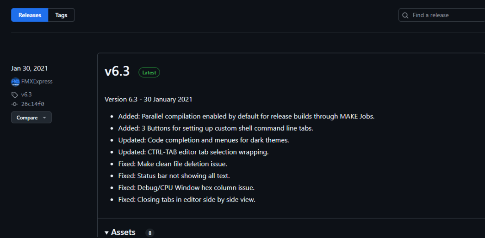
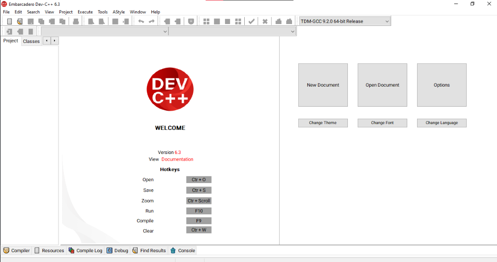

# Instalación de Embarcadero Dev C++

## Paso 1: Descargar el Instalador

1. **Accede al repositorio Oficial:**  
   Visita el repositorio de Embarcadero o la sección de descargas correspondiente a Dev C++.
2. **Selecciona la Versión Adecuada:**  
   Asegúrate de elegir la versión correcta para tu sistema operativo y necesidades.

3. **Descarga el Archivo:**  
    Haz clic en el botón de descarga para obtener el archivo ejecutable (por ejemplo, `EmbarcaderoDevCppInstaller.exe`).
   -- 
   -- 
   -- 

## Paso 2: Ejecutar el Instalador

1. **Ubica el Archivo Descargado:**  
   Navega hasta la carpeta donde se descargó el instalador.
   

2. **Ejecuta el Archivo:**  
   Haz doble clic sobre el archivo descargado. Es posible que aparezca un mensaje de control de cuentas de usuario; confirma para continuar.

## Paso 3: Configuración de la Instalación

1. **Acepta los Términos y Condiciones:**  
   Revisa y acepta los términos del contrato de licencia de uso.

2. **Elige la Ruta de Instalación:**  
   Puedes optar por la ruta predeterminada o seleccionar otra ubicación en tu disco duro.

3. **Selecciona los Componentes a Instalar:**  
   El instalador puede permitirte escoger entre distintos componentes (como editores, compiladores, herramientas adicionales, etc.). Selecciona aquellos que necesites o elige la opción completa para una instalación completa.
   
   

4. **Inicia la Instalación:**  
   Haz clic en el botón “Instalar” para comenzar el proceso.
   

---

## Paso 4: Finalizar la Instalación

1. **Proceso de Instalación:**  
   Espera mientras el instalador copia los archivos y configura el entorno. Esto puede tardar unos minutos.

2. **Finaliza el Proceso:**  
   Una vez completado, aparecerá un mensaje de confirmación. Haz clic en “Finalizar”.
   

3. **Reinicio (si es necesario):**  
   Algunos instaladores pueden requerir un reinicio del sistema. Si es el caso, guarda tu trabajo y reinicia tu equipo.

---

## Paso 5: Configuración Inicial y Verificación

1. **Abrir Embarcadero Dev C++:**  
   Inicia el programa desde el menú de inicio o el acceso directo en el escritorio.
   

2. **Configurar el Entorno:**

   - Selecciona el compilador
     
     

3. **Prueba de Funcionamiento:**
   - Compila y ejecuta un archivo .cpp para asegurarte de que todo funcione correctamente.

---

## Recursos Adicionales

- **Documentación Oficial:**  
  Consulta la [documentación de Embarcadero](https://www.embarcadero.com) para obtener detalles sobre características y solución de problemas.
